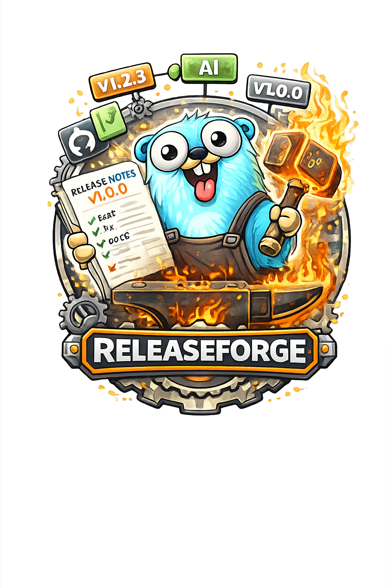

<div align="center">
  
</div>

# ReleaseForge

<div align="center">
  <p>
    
    
    
  </p>
</div>

**Release smarter**: Generate AI-powered release notes, analyze conventional commits, and automate semver bumps from your git history.

## TL;DR

```sh
# Install
curl -L https://github.com/AxeForging/releaseforge/releases/latest/download/releaseforge-linux-amd64.tar.gz | tar xz
sudo mv releaseforge-linux-amd64 /usr/local/bin/releaseforge

# Generate release notes with AI (Gemini by default)
releaseforge generate --git-tag v1.0.0 --analyze-from-tag

# Generate without AI (git commit analysis only)
releaseforge generate --force-git-mode --git-tag v1.0.0 --analyze-from-tag

# Analyze commits and suggest next semver version
releaseforge bump --tag v1.2.3

# Validate conventional commit format
releaseforge check --tag v1.2.3 --strict
```

## Features

- **AI-powered release notes** using Gemini, OpenAI, or Anthropic
- **No-AI mode** with git commit log analysis (no API key needed)
- **Conventional commit analysis** for automatic semver bump suggestions
- **Commit format validation** for CI pipelines
- **Multiple built-in templates** (semver release notes, conventional changelog, version analysis)
- **Custom templates** via file path or raw string
- **JSON and text output** for CI/CD integration
- **Auto-detection** of latest tags and commit ranges

---

## Install

<details>
<summary><strong>Linux/macOS (AMD64)</strong></summary>

```sh
curl -L https://github.com/AxeForging/releaseforge/releases/latest/download/releaseforge-linux-amd64.tar.gz | tar xz
chmod +x releaseforge-linux-amd64
sudo mv releaseforge-linux-amd64 /usr/local/bin/releaseforge
```

</details>

<details>
<summary><strong>Linux/macOS (ARM64 / Apple Silicon)</strong></summary>

```sh
# Linux ARM64
curl -L https://github.com/AxeForging/releaseforge/releases/latest/download/releaseforge-linux-arm64.tar.gz | tar xz
chmod +x releaseforge-linux-arm64
sudo mv releaseforge-linux-arm64 /usr/local/bin/releaseforge

# macOS Apple Silicon
curl -L https://github.com/AxeForging/releaseforge/releases/latest/download/releaseforge-darwin-arm64.tar.gz | tar xz
chmod +x releaseforge-darwin-arm64
sudo mv releaseforge-darwin-arm64 /usr/local/bin/releaseforge
```

</details>

<details>
<summary><strong>Windows (PowerShell)</strong></summary>

```powershell
Invoke-WebRequest -Uri https://github.com/AxeForging/releaseforge/releases/latest/download/releaseforge-windows-amd64.zip -OutFile releaseforge.zip
Expand-Archive -Path releaseforge.zip -DestinationPath .
Move-Item -Path releaseforge-windows-amd64.exe -Destination releaseforge.exe
```

</details>

<details>
<summary><strong>From Source (Go 1.24+)</strong></summary>

```sh
go install github.com/AxeForging/releaseforge@latest
```

Or build locally:

```sh
git clone https://github.com/AxeForging/releaseforge.git
cd releaseforge
make build-local
sudo mv releaseforge /usr/local/bin/
```

</details>

---

## Commands

### generate - Generate release notes

Generate release notes from git commits using AI or git-based analysis.

```sh
# AI-powered (requires API key)
export GEMINI_API_KEY=your-key-here
releaseforge generate --git-tag v1.0.0 --analyze-from-tag

# With a specific provider and model
releaseforge generate --provider openai --model gpt-4o --key $OPENAI_API_KEY \
  --git-tag v1.0.0 --analyze-from-tag

# No-AI mode (git commit analysis only)
releaseforge generate --force-git-mode --git-tag v1.0.0 --analyze-from-tag

# Custom template
releaseforge generate --template ./my-template.md --git-tag v1.0.0 --analyze-from-tag

# Save output to specific path
releaseforge generate --force-git-mode -o ./RELEASE_NOTES.md
```

<details>
<summary><strong>All flags</strong></summary>

| Flag | Alias | Description | Default |
|------|-------|-------------|---------|
| `--provider` | `-p` | LLM provider: gemini, openai, anthropic | `gemini` |
| `--model` | `-m` | Model name | `gemini-2.0-flash` |
| `--key` | `-k` | API key (or use env vars) | - |
| `--git-sha` | | Analyze a specific commit | - |
| `--git-tag` | | Git tag to analyze | - |
| `--analyze-from-tag` | | Analyze commits after the tag | `false` |
| `--max-commits` | | Max commits to analyze | `100` |
| `--template` | `-t` | Path to template file | - |
| `--template-name` | `-tn` | Built-in template name | - |
| `--template-raw` | `-tr` | Raw template string | - |
| `--system-prompt` | `-sp` | Additional system prompt lines | - |
| `--ignore-list` | `-il` | File paths to ignore | - |
| `--tags-context-count` | | Tags for version context | `15` |
| `--disable-tags-context` | | Skip fetching tags context | `false` |
| `--output` | `-o` | Output file path | `/tmp/` |
| `--use-git-fallback` | | Fallback to git if LLM fails | `false` |
| `--force-git-mode` | | Use git analysis only (no AI) | `false` |
| `--verbose` | `-v` | Debug logging | `false` |

</details>

### bump - Suggest next semver version

Analyze conventional commits between a tag and branch to determine the appropriate version bump.

```sh
# Auto-detect latest tag, compare to HEAD
releaseforge bump

# Specify base tag
releaseforge bump --tag v1.2.3

# Compare to a specific branch
releaseforge bump --tag v1.2.3 --branch main

# Quiet mode (outputs version only, ideal for scripts)
releaseforge bump --tag v1.2.3 --quiet

# Save outputs for CI
releaseforge bump --output-version next-version.txt --output-json analysis.json
```

<details>
<summary><strong>All flags</strong></summary>

| Flag | Alias | Description | Default |
|------|-------|-------------|---------|
| `--tag` | | Base semver tag to compare against | auto-detect |
| `--branch` | `-b` | Target branch or ref | `HEAD` |
| `--max-commits` | | Max commits to analyze | `200` |
| `--output-json` | | Save analysis as JSON | - |
| `--output-version` | | Save version string to file | - |
| `--quiet` | `-q` | Output version only | `false` |
| `--verbose` | `-v` | Debug logging | `false` |

</details>

### check - Validate conventional commits

Check that commits follow the [Conventional Commits](https://www.conventionalcommits.org/) specification.

```sh
# Check commits since last tag
releaseforge check --tag v1.2.3

# Strict mode (exit code 1 if non-conventional commits found)
releaseforge check --tag v1.2.3 --strict
```

<details>
<summary><strong>All flags</strong></summary>

| Flag | Alias | Description | Default |
|------|-------|-------------|---------|
| `--tag` | | Base semver tag to compare against | auto-detect |
| `--branch` | `-b` | Target branch or ref | `HEAD` |
| `--max-commits` | | Max commits to analyze | `200` |
| `--strict` | `-s` | Fail on non-conventional commits | `false` |
| `--verbose` | `-v` | Debug logging | `false` |

</details>

### templates - List built-in templates

```sh
releaseforge templates
```

### version - Show version info

```sh
releaseforge version
```

---

## Conventional Commit Types

The `bump` and `check` commands understand the [Conventional Commits](https://www.conventionalcommits.org/) specification:

| Type | Semver Impact | Description |
|------|--------------|-------------|
| `feat` | **MINOR** | A new feature |
| `fix` | **PATCH** | A bug fix |
| `perf` | **PATCH** | A performance improvement |
| `revert` | **PATCH** | Reverts a previous commit |
| `docs` | No bump | Documentation only changes |
| `style` | No bump | Code style changes (formatting, whitespace) |
| `refactor` | No bump | Code refactoring (no bug fix or feature) |
| `test` | No bump | Adding or correcting tests |
| `build` | No bump | Build system or dependency changes |
| `ci` | No bump | CI/CD configuration changes |
| `chore` | No bump | Maintenance tasks |

**Breaking changes** always trigger a **MAJOR** bump:
- Using `!` after the type: `feat!: redesign API` or `fix(auth)!: change token format`
- Using `BREAKING CHANGE:` in the commit footer

### Commit format

```
<type>[optional scope][!]: <description>

[optional body]

[optional footer(s)]
```

**Examples:**
```
feat(auth): add OAuth2 support
fix: resolve null pointer in user lookup
feat!: redesign REST API endpoints
chore(deps): update Go to 1.24
docs: add installation guide

feat(api): add batch processing

BREAKING CHANGE: removed /v1 endpoints
```

---

## LLM Providers

ReleaseForge supports three LLM providers for AI-powered release notes:

| Provider | Default Model | API Key Env Var |
|----------|--------------|-----------------|
| **Gemini** (default) | `gemini-2.0-flash` | `GEMINI_API_KEY` |
| **OpenAI** | `gpt-4o` | `OPENAI_API_KEY` |
| **Anthropic** | `claude-sonnet-4-5-20250929` | `ANTHROPIC_API_KEY` |

```sh
# Gemini (default)
export GEMINI_API_KEY=your-key
releaseforge generate --git-tag v1.0.0 --analyze-from-tag

# OpenAI
export OPENAI_API_KEY=your-key
releaseforge generate --provider openai --model gpt-4o --git-tag v1.0.0 --analyze-from-tag

# Anthropic
export ANTHROPIC_API_KEY=your-key
releaseforge generate --provider anthropic --model claude-sonnet-4-5-20250929 --git-tag v1.0.0 --analyze-from-tag
```

---

## Built-in Templates

| Name | Description |
|------|-------------|
| `semver-release-notes` | Standard release notes with semver analysis |
| `conventional-changelog` | Changelog grouped by commit type |
| `version-analysis` | Focused version bump analysis |

```sh
# Use a built-in template
releaseforge generate --template-name conventional-changelog --git-tag v1.0.0 --analyze-from-tag

# List all templates
releaseforge templates
```

---

## CI/CD Integration

### GitHub Actions - Version Bump

```yaml
- name: Get next version
  run: |
    NEXT=$(releaseforge bump --tag $(git describe --tags --abbrev=0) --quiet)
    echo "next_version=$NEXT" >> $GITHUB_OUTPUT
  id: version
```

### GitHub Actions - Conventional Commit Check

```yaml
- name: Check commit format
  run: |
    releaseforge check --tag $(git describe --tags --abbrev=0) --strict
```

### GitHub Actions - Release Notes

```yaml
- name: Generate release notes
  env:
    GEMINI_API_KEY: ${{ secrets.GEMINI_API_KEY }}
  run: |
    releaseforge generate --git-tag ${{ github.ref_name }} --analyze-from-tag -o release-notes.md
```

---

## Exit Codes

| Code | Meaning |
|------|---------|
| `0` | Success |
| `1` | Error (invalid flags, git error, API failure, strict mode violation) |

---

## Development

```sh
# Build
make build-local

# Run tests
make test

# Cross-compile all platforms
make build

# Tag a release
VERSION=v1.0.0 make tag
```

---

## License

MIT - see [LICENSE](LICENSE)
